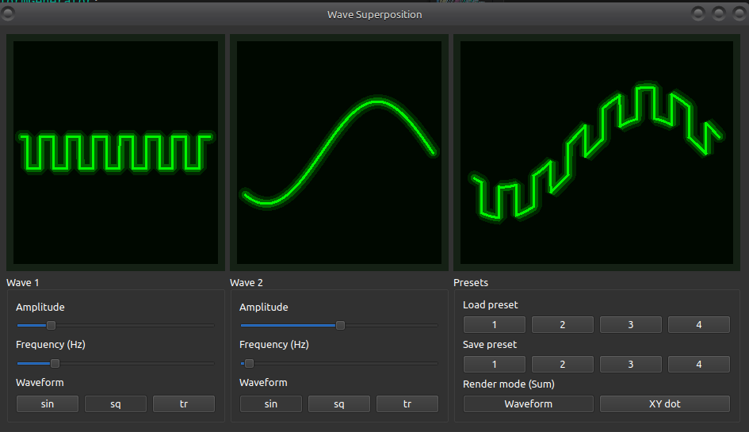
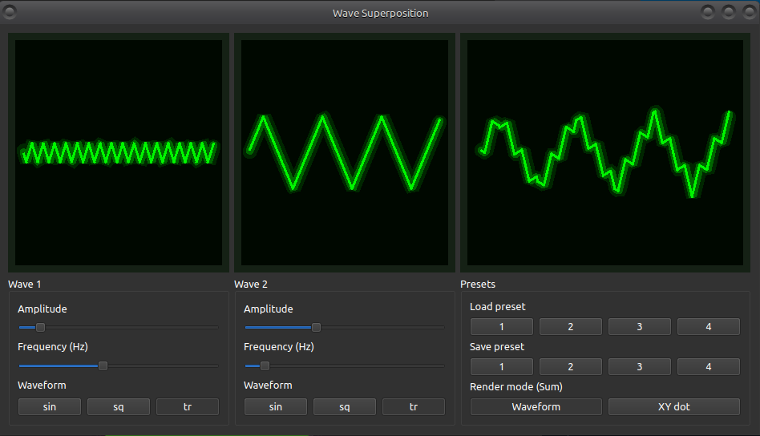

# Neon CRT Wave Superposition Oscilloscope

This application is a real-time oscilloscope simulator built in **Python + PyQt6 + PyQtGraph**.
It generates two independent waveforms (Wave 1 and Wave 2) and displays both of them along with their **sum**.
The display is rendered with a **classic green CRT phosphor effect** including glow, afterglow trails, bloom, vignette and subtle noise.

---

## ✨ Features

- **Two independent waveform generators**
  - Sine, Triangle, Square waves
  - Adjustable frequency (0–20 kHz)
  - Adjustable amplitude

- **Live superposition display**
  - Third oscilloscope shows the sum of Wave 1 and Wave 2
  - Smooth animation with CRT-style glow and persistence

- **Neon CRT aesthetics**
  - Green phosphor beam
  - Multi-layer glow
  - Afterglow trail effect
  - Noise overlay
  - Subtle vignette

- **Preset system (1–4 slots)**
  - Instant save/load
  - Empty presets revert to default waveform settings

- **Fast GUI**
  - PyQt6 interface
  - PyQtGraph high-performance plot rendering
  - Consistent 60+ FPS animation

---

## 📸 Screenshots






---

## 🚀 Running the application

Install dependencies:

```bash
pip install pyqt6 pyqtgraph numpy
```

Run the app:

```bash
python3 main.py
```
